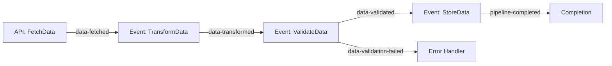
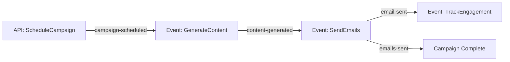

# Workflow Documentation

This document provides detailed information about each workflow in the Motia Workflow Orchestrator project.

## Table of Contents

- [Data Processing Pipeline](#data-processing-pipeline)
- [Scheduled Tasks](#scheduled-tasks)
- [Email Campaign](#email-campaign)

---

## Data Processing Pipeline

### Overview
A complete ETL (Extract, Transform, Load) pipeline demonstrating event-driven data processing with state tracking and error handling.

### Architecture



### Steps Detail

#### 1. FetchData (API Endpoint)
- **Type**: API
- **Path**: `/pipeline/fetch`
- **Method**: POST
- **Trigger**: HTTP Request

**Request Schema:**
```json
{
  "source": "string (required)",
  "batchSize": "number (optional, default: 100)"
}
```

**What it does:**
1. Accepts data source and batch size
2. Generates mock data (simulates fetching from external source)
3. Stores initial pipeline state
4. Emits `data-fetched` event with data payload

**State Stored:**
```typescript
{
  status: 'fetching',
  source: string,
  batchSize: number,
  startedAt: ISO timestamp,
  recordsFetched: number
}
```

---

#### 2. TransformData (Event Handler)
- **Type**: Event
- **Subscribes to**: `data-fetched`
- **Trigger**: Event emission from FetchData

**What it does:**
1. Receives raw data from fetch step
2. Normalizes values (0-1 range)
3. Categorizes data (high/low)
4. Adds processing metadata
5. Emits `data-transformed` event

**Transformation Logic:**
- `normalizedValue = value / 100`
- `category = value > 50 ? 'high' : 'low'`
- Adds `transformedAt` timestamp
- Adds `processedBy` identifier

---

#### 3. ValidateData (Event Handler)
- **Type**: Event
- **Subscribes to**: `data-transformed`
- **Emits**: `data-validated` OR `data-validation-failed`
- **Trigger**: Event emission from TransformData

**What it does:**
1. Validates each record against business rules
2. Separates valid and invalid records
3. Calculates validation rate
4. Emits appropriate event based on results

**Validation Rules:**
- `id > 0`
- `value >= 0`
- `normalizedValue` exists
- `category` is 'high' or 'low'

**Conditional Logic:**
- If valid records exist → emit `data-validated`
- If all records fail → emit `data-validation-failed`

---

#### 4. StoreData (Event Handler)
- **Type**: Event
- **Subscribes to**: `data-validated`
- **Emits**: `pipeline-completed`
- **Trigger**: Event emission from ValidateData

**What it does:**
1. Stores validated data in state
2. Calculates pipeline duration
3. Updates final pipeline status
4. Emits completion event

**Final State:**
```typescript
{
  status: 'completed',
  source: string,
  stats: {
    total: number,
    valid: number,
    invalid: number,
    validationRate: number
  },
  timeline: {
    fetchedAt: ISO timestamp,
    transformedAt: ISO timestamp,
    validatedAt: ISO timestamp,
    storedAt: ISO timestamp
  },
  durationMs: number,
  completedAt: ISO timestamp
}
```

### Testing the Pipeline

**1. Trigger via curl:**
```bash
curl -X POST http://localhost:3000/pipeline/fetch \
  -H "Content-Type: application/json" \
  -d '{
    "source": "test-api.example.com",
    "batchSize": 25
  }'
```

**2. Observe in Workbench:**
- Navigate to the pipeline flow visualization
- Watch events propagate through all 4 steps
- Click on each step execution to see:
  - Input data
  - Output data
  - State changes
  - Execution time

**3. Check State:**
- View pipeline state using the pipeline ID
- Inspect stored data in the storage state group

---

## Scheduled Tasks

### Overview
Three cron jobs demonstrating different scheduling patterns and maintenance tasks.

### Steps Detail

#### 1. DailyReportGenerator
- **Type**: Cron
- **Schedule**: `0 9 * * *` (Daily at 9:00 AM)
- **Emits**: `daily-report-generated`

**What it does:**
1. Aggregates pipeline execution data
2. Generates summary statistics
3. Stores report in state
4. Emits event for potential email notification

**Report Structure:**
```typescript
{
  date: 'YYYY-MM-DD',
  generatedAt: ISO timestamp,
  summary: {
    totalPipelines: number,
    successfulPipelines: number,
    failedPipelines: number,
    totalRecordsProcessed: number,
    averageDurationMs: number
  },
  topSources: Array<{ source: string, count: number }>
}
```

---

#### 2. CleanupOldData
- **Type**: Cron
- **Schedule**: `0 2 * * 0` (Weekly, Sunday at 2:00 AM)
- **Emits**: `cleanup-completed`

**What it does:**
1. Identifies data older than 30 days
2. Removes old pipeline records
3. Removes old reports
4. Logs cleanup statistics

**Cleanup Results:**
```typescript
{
  pipelinesDeleted: number,
  reportsDeleted: number,
  storageFreedMB: number,
  oldestRecordDate: ISO timestamp,
  executedAt: ISO timestamp,
  durationMs: number
}
```

---

#### 3. SystemHealthCheck
- **Type**: Cron
- **Schedule**: `*/5 * * * *` (Every 5 minutes)
- **Emits**: `health-check-completed` OR `health-check-alert`

**What it does:**
1. Checks system metrics (CPU, memory, disk, response time)
2. Determines health status
3. Generates alerts if thresholds exceeded
4. Emits appropriate event

**Health Metrics:**
```typescript
{
  cpu: number (0-100),
  memory: number (0-100),
  diskSpace: number (0-100),
  activeConnections: number,
  queueDepth: number,
  responseTimeMs: number
}
```

**Alert Thresholds:**
- CPU > 80%
- Memory > 85%
- Disk Space > 90%
- Response Time > 300ms

**Conditional Events:**
- Healthy system → `health-check-completed`
- Degraded system → `health-check-alert` (with severity: 'warning' or 'critical')

### Testing Cron Jobs

**Manual Trigger in Workbench:**
1. Navigate to the Cron Jobs section
2. Find the desired cron job
3. Click "Run Now" to trigger manually
4. Observe execution in real-time

---

## Email Campaign

### Overview
A complete email marketing workflow with scheduling, content generation, batch sending, and engagement tracking.

### Architecture



### Steps Detail

#### 1. ScheduleCampaign (API Endpoint)
- **Type**: API
- **Path**: `/campaign/schedule`
- **Method**: POST
- **Trigger**: HTTP Request

**Request Schema:**
```json
{
  "campaignName": "string (required)",
  "recipients": ["email1@example.com", "email2@example.com"],
  "subject": "string (required)",
  "template": "string (optional, default: 'default')",
  "scheduledFor": "ISO timestamp (optional)"
}
```

**What it does:**
1. Creates campaign record
2. Stores campaign details in state
3. Emits `campaign-scheduled` event
4. Returns campaign ID

---

#### 2. GenerateContent (Event Handler)
- **Type**: Event
- **Subscribes to**: `campaign-scheduled`
- **Emits**: `content-generated`

**What it does:**
1. Generates personalized email content
2. Creates content variations (simulates AI)
3. Stores content in state
4. Emits event to start sending

**Generated Content:**
```typescript
{
  subject: string,
  bodyTemplate: string,
  personalizationFields: string[],
  contentVariations: string[],
  generatedAt: ISO timestamp
}
```

---

#### 3. SendEmails (Event Handler)
- **Type**: Event
- **Subscribes to**: `content-generated`
- **Emits**: `email-sent` (per email), `emails-sent` (completion)

**What it does:**
1. Processes recipients in batches (10 at a time)
2. Applies rate limiting (1 second between batches)
3. Simulates email sending (95% success rate)
4. Updates progress in state
5. Emits individual and completion events

**Rate Limiting:**
- Batch size: 10 emails
- Delay between batches: 1000ms
- Prevents overwhelming email service

**Progress Tracking:**
```typescript
{
  status: 'sending',
  sentCount: number,
  failedCount: number,
  progress: string (percentage)
}
```

---

#### 4. TrackEngagement (Event Handler)
- **Type**: Event
- **Subscribes to**: `email-sent`
- **Emits**: None (terminal step)

**What it does:**
1. Simulates engagement tracking
2. Records opens (60% rate)
3. Records clicks (30% rate)
4. Stores engagement data

**Engagement Data:**
```typescript
{
  recipient: string,
  subject: string,
  sentAt: ISO timestamp,
  status: string,
  opened: boolean,
  openedAt: ISO timestamp | null,
  clicked: boolean,
  clickedAt: ISO timestamp | null,
  trackedAt: ISO timestamp
}
```

### Testing Email Campaign

**1. Create a campaign:**
```bash
curl -X POST http://localhost:3000/campaign/schedule \
  -H "Content-Type: application/json" \
  -d '{
    "campaignName": "Test Campaign",
    "recipients": [
      "user1@example.com",
      "user2@example.com",
      "user3@example.com"
    ],
    "subject": "Welcome to Motia!",
    "template": "welcome"
  }'
```

**2. Observe in Workbench:**
- Watch the campaign flow through all 4 steps
- See batch processing in action
- Monitor progress updates
- View individual email events
- Check engagement tracking

**3. Inspect State:**
- Campaign details: `campaigns` group
- Generated content: `campaign-content` group
- Engagement data: `email-tracking` group

---

## Event Flow Patterns

### Linear Flow
```
Step A → Event → Step B → Event → Step C
```
Example: Data Pipeline (fetch → transform → validate → store)

### Broadcast Pattern
```
Step A → Event → Step B
              → Step C
              → Step D
```
Example: SendEmails emits `email-sent` for each recipient

### Conditional Flow
```
Step A → Event (success) → Step B
      → Event (failure) → Step C
```
Example: ValidateData emits different events based on validation results

---

## State Management Patterns

### Pipeline Tracking
```typescript
await state.set('pipelines', pipelineId, {
  status: 'processing',
  currentStep: 'transform',
  progress: 50
});
```

### Result Storage
```typescript
await state.set('storage', storageKey, {
  data: processedData,
  metadata: { ... }
});
```

### Metrics Aggregation
```typescript
await state.set('reports', reportId, {
  summary: { ... },
  generatedAt: timestamp
});
```

---

## Best Practices Demonstrated

1. **Unique IDs**: All workflows use unique identifiers for tracking
2. **State Updates**: State is updated at each significant step
3. **Comprehensive Logging**: All actions are logged with context
4. **Error Handling**: Validation failures trigger different event paths
5. **Progress Tracking**: Long-running tasks update progress in state
6. **Rate Limiting**: Batch processing prevents overwhelming external services
7. **Event Naming**: Clear, descriptive event names (past tense: `data-fetched`)
8. **Type Safety**: Zod schemas validate all inputs

---

## Extending the Workflows

### Adding a New Step

1. Create a new `.step.ts` file
2. Define the config (type, subscribes, emits)
3. Implement the handler
4. Restart dev server to register

### Adding Error Handling

```typescript
try {
  // Step logic
} catch (error) {
  logger.error('Step failed', { error });
  await emit({
    topic: 'step-failed',
    data: { error: error.message }
  });
}
```

### Adding Retry Logic

Motia handles retries automatically for failed Steps. Configure in `motia.config.ts`:

```typescript
export default {
  retries: 3,
  retryDelay: 1000
};
```
